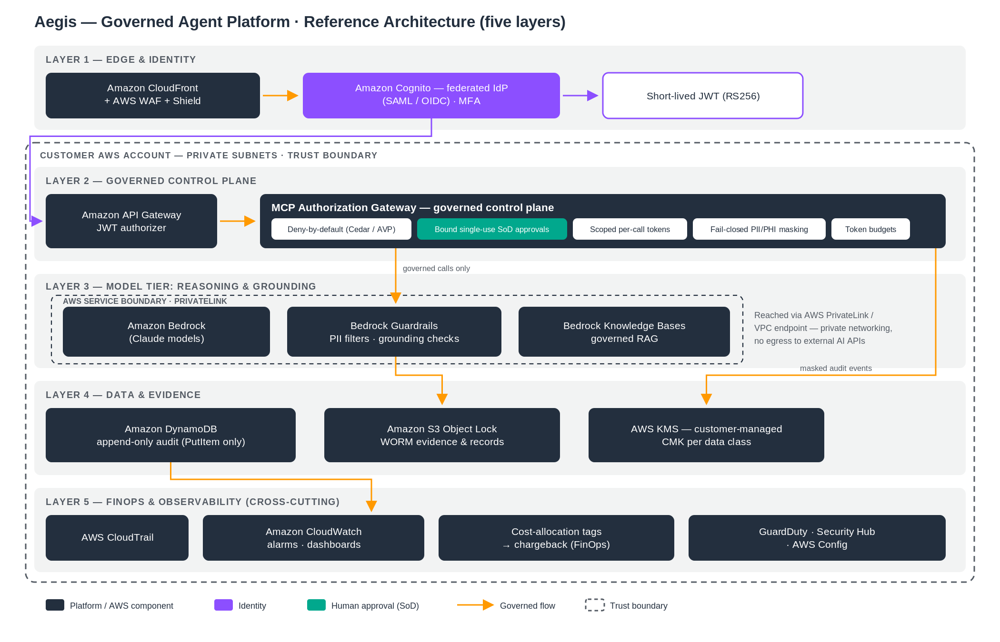

# Aegis — Governed Agent Platform

> **Status & maturity (read first).** Aegis is a **live-validated reference platform**, not an
> authorized product. Across **ten documented AWS runs** ([`DEPLOYED-AND-VALIDATED.md`](DEPLOYED-AND-VALIDATED.md))
> the deny-by-default **Cedar authorization** (Verified Permissions), **hardened identity** (Cognito
> MFA + cryptographic JWT verification), the **human-approval reviewer service** behind an API Gateway
> JWT authorizer, **append-only audit + WORM retention**, **KMS-signed manifests + atomic token
> budgets**, a **governed connector** (idempotency + saga rollback), and a **live MCP JSON-RPC
> gateway endpoint** (JWT authN, deny-by-default allow-list, approval gate, masked audit) were each
> **deployed, exercised with real requests, and torn down**. Still customer/engagement-owned: ATO/GovRAMP authorization, an
> independent pen test, a live external-SaaS connector, multi-account/multi-tenant deployment, and
> operator dashboards. Authoritative per-control maturity + plan:
> [`docs/GAP-CLOSURE-BACKLOG.md`](docs/GAP-CLOSURE-BACKLOG.md).

## Capability maturity matrix

✅ = evidence in this repo (code + tests, or a documented live AWS run) · ◻ = not done here / engagement work.
Live-AWS cells reflect the ten documented deploy/validate/teardown runs ([`DEPLOYED-AND-VALIDATED.md`](DEPLOYED-AND-VALIDATED.md), 2026-06-30 → 2026-07-07); per-control detail is in [`docs/GAP-CLOSURE-BACKLOG.md`](docs/GAP-CLOSURE-BACKLOG.md).

| Capability | Designed | Implemented (offline/tested) | Deployed on AWS (validated) | Integration-tested on AWS | Production-ready | Owner (Repo/Customer) |
|---|:--:|:--:|:--:|:--:|:--:|---|
| Identity / authN | ✅ | ✅ | ✅ | ✅ | ◻ | Repo (enterprise IdP federation: Customer) |
| MCP / tool authorization gateway | ✅ | ✅ | ✅ | ✅ | ◻ | Repo (Run 10: live MCP JSON-RPC endpoint, allow+deny paths over HTTPS; AgentCore Gateway: Customer) |
| Policy enforcement (deny-by-default) | ✅ | ✅ | ✅ | ✅ | ◻ | Repo |
| Human approval (SoD, single-use) | ✅ | ✅ | ✅ | ✅ | ◻ | Repo |
| PII/PHI masking | ✅ | ✅ | ✅ | ✅ | ◻ | Repo (regex masking live-proven in Run 10; runtime Comprehend/Macie wiring: Customer) |
| Audit (append-only + WORM) | ✅ | ✅ | ✅ | ✅ | ◻ | Repo |
| Bedrock + Guardrails | ✅ | ✅ | ✅ | ✅ | ◻ | Repo |
| IaC deploy (golden path) | ✅ | ✅ | ✅ | ✅ | ◻ | Repo |
| Live connectors | ✅ | ✅ | ◻ | ◻ | ◻ | Customer (fixtures/stand-ins here; real SaaS is engagement work) |
| CI/CD | ✅ | ✅ | ◻ | ◻ | ◻ | Repo (lint + tests; no cloud deploys in CI) / Customer |
| Monitoring / alerts | ✅ | ◻ | ◻ | ◻ | ◻ | Customer |
| DR / backup | ✅ | ◻ | ◻ | ◻ | ◻ | Customer |
| Compliance evidence | ✅ | ✅ | ◻ | ◻ | ◻ | Repo (mappings + evidence index) / Customer (ATO/GovRAMP evidence) |

Nothing in this repository is production-certified; see [`docs/10-PRODUCTION-READINESS-RACI.md`](docs/10-PRODUCTION-READINESS-RACI.md) for the full RACI.

*Governance once, agents as add-ons: this repo's `platform_core` is the **canonical reference implementation of the Aegis Governance Pattern (AGP) v1.0** — the versioned governance contract every suite conforms to. See [`docs/14-GOVERNANCE-PATTERN-VERSIONING.md`](docs/14-GOVERNANCE-PATTERN-VERSIONING.md).*

> **Validation update (2026-07-07/08).** All deployment claims were independently re-verified against the validation account (stack history, CloudTrail, KMS deletion markers), and **Run 10 added a live MCP JSON-RPC gateway endpoint** — JWT authN (401s proven), deny-by-default tool allow-list, approval gate, fail-closed masking, IAM-level append-only audit — deployed, exercised over HTTPS, and torn down. Sanitized proof pack: [`evidence/CLEAN-ACCOUNT-ACCEPTANCE.md`](evidence/CLEAN-ACCOUNT-ACCEPTANCE.md).

### A whole-of-government and whole-of-enterprise governance layer for AI agents, built on AWS

> **The agent is not the product. The governance that makes any agent deployable, auditable,
> chargeable, and compliant — in any regulated environment — is the product.**

Aegis is an **industry-agnostic governance core** plus **pluggable compliance overlay packs**.
You build the governed "paved road" once; every future agent, model, and MCP tool inherits
identity, authorization, audit, data-class isolation, hallucination control, token budgets,
and departmental chargeback automatically. New agents are onboarded one at a time against a
published **minimum bar**, and packaged agents can be sold and deployed as add-ons into any
customer's already-governed environment.

This repository generalizes the SLG-focused accelerator
[`virtualryder/slg-ai-agents`](https://github.com/virtualryder/slg-ai-agents) into a horizontal
platform. See [`docs/09-REPO-REVIEW-slg-ai-agents.md`](docs/09-REPO-REVIEW-slg-ai-agents.md) for
the gap analysis and what carries forward versus what is new here.

---

## What it is, in one paragraph

Aegis sits between your AI agents and your systems of record. Every agent action — every model
call, every tool call, every retrieval — flows through a **deny-by-default authorization gateway**
that enforces *least-privilege as an intersection* (an agent can never exceed the human it acts
for), withholds consequential actions for a **human gate**, masks PII/PHI/FTI/CJI at every
boundary, writes a **tamper-evident append-only audit** record, validates model output for
**hallucinations**, meters and caps **token spend**, and attributes that spend back to the
owning department. Compliance regimes are applied as **overlay packs** that switch on the right
controls, regions, and retention for the customer's industry. It is all built on AWS-native,
GA services — no black box, no lock-in.

## Who it is for and why they care

| Persona | Their question | How Aegis answers it |
|---|---|---|
| **CIO / CDO** | "How do I get out of the pilot trap and scale AI safely without a one-off project per agent?" | One governed paved road; every agent inherits it. Onboard agent-by-agent on a funded, repeatable pattern. |
| **CISO** | "Can the AI act on its own? Can I trust identity? Will the audit hold up? Where does data go?" | Consequential actions withheld in code + human gate; cryptographic identity; append-only WORM audit; private-connectivity inference (Bedrock via PrivateLink) with guardrails. |
| **Director / Chief Architect** | "Is this one maintainable pattern or eight integrations?" | A single reference architecture reused across every agent; IaC; standard agent manifest; no per-agent re-architecture. |
| **CFO / Budget owner** | "How do I control and allocate AI spend across departments?" | Token budgets with hard caps + per-department **showback/chargeback** via Bedrock application inference profiles and cost-allocation tags. |
| **CEO / Agency head** | "What's the business case and the risk story?" | Documented outcomes per workflow + a candid shared-responsibility model that survives a review board. |

## The platform in five layers



Editable source: the SVG in [`docs/diagrams/`](docs/diagrams/) (open in draw.io, Inkscape, or any text editor).

1. **Edge & identity** — CloudFront + WAF + Shield → Amazon Cognito / federated IdP → short-lived
   JWT → API Gateway authorizer.
2. **Governed control plane (the core)** — MCP authorization gateway (AgentCore Gateway or
   API Gateway + policy engine): deny-by-default, least-privilege intersection, scoped per-call
   tokens, human-gate, token budgets, append-only audit.
3. **Reasoning & grounding** — Amazon Bedrock models via PrivateLink, mandatory Guardrails
   (PII filters + **contextual grounding** + **automated reasoning** checks), governed RAG over a
   Bedrock Knowledge Base.
4. **Data & evidence** — KMS CMK per data class, DynamoDB append-only audit, S3 Object Lock (WORM),
   Macie/Comprehend for discovery + masking, data-class isolation (CJI / FTI / PHI / EDU / public).
5. **FinOps & observability** — application inference profiles + cost-allocation tags →
   Cost Explorer / CUR for chargeback; CloudTrail, GuardDuty, Security Hub, Config, X-Ray.

The control-plane enforcement sequence — every request, token, approval, and deny path:


See [`docs/02-REFERENCE-ARCHITECTURE.md`](docs/02-REFERENCE-ARCHITECTURE.md) for the full
edge-to-data architecture, per-component talking points, and the control→regime mapping.

## Compliance overlay packs

The governance core is industry-agnostic. An **overlay pack** is a declarative bundle that turns
on the controls, AWS regions, retention, and evidence a given regime requires:

- **`packs/slg`** — GovRAMP/FedRAMP, CJIS v6.0, IRS Pub 1075 (FTI), NIST AI RMF.
- **`packs/education`** — FERPA, amended COPPA (2025), state student-privacy laws.
- **`packs/healthcare-lifesciences`** — HIPAA/HITECH, 42 CFR Part 2, GxP / 21 CFR Part 11, HITRUST.
- **`packs/enterprise`** — SOC 2, PCI DSS, ISO 27001, sector-agnostic data governance.

Each pack maps to NIST 800-53 and the NIST AI RMF Generative AI Profile, and marks every control
**Implemented** (offline reference and/or deployed IaC — see maturity matrix) vs **Configurable** (customer-owned). See
[`docs/03-COMPLIANCE-OVERLAY-PACKS.md`](docs/03-COMPLIANCE-OVERLAY-PACKS.md).

> **Auditors / GRC reviewers:** the [`assurance/`](assurance/README.md) packet is a single
> curated cover sheet indexing every threat-model, control-mapping, evidence, and
> shared-responsibility artifact under standard assurance headings.

## Onboarding a new agent

Every agent — first-party or add-on — is described by a signed **agent manifest**
(`governance/onboarding/agent-manifest.schema.json`) and must clear the published **minimum bar**
(`governance/onboarding/MINIMUM-BAR.md`) before it can touch a system of record. The manifest
declares the agent's grants, the tools/MCP servers it may reach, its data classes, its token
budget, its grounding sources, and its consequential (human-gated) actions. CI rejects any agent
that exceeds its declared scope. See [`docs/04-AGENT-ONBOARDING-STANDARD.md`](docs/04-AGENT-ONBOARDING-STANDARD.md).

## The add-on / marketplace model

Because governance is inherited, agents become **portable products**. A packaged agent ships its
manifest + tool definitions + grounding pack + eval suite; dropping it into any Aegis-governed
environment is a one-command deploy that automatically picks up the customer's identity, data
classes, guardrails, budgets, and audit. This is the path to selling agents as add-ons across
industries without re-doing governance each time. See
[`docs/08-GTM-AND-POSITIONING.md`](docs/08-GTM-AND-POSITIONING.md).

## Proven on AWS (ten live runs)

The hard controls have each been deployed to AWS, exercised with real requests, and torn down — full
log in [`DEPLOYED-AND-VALIDATED.md`](DEPLOYED-AND-VALIDATED.md).

| Run | Proven live, then torn down |
|---|---|
| 1 | Governance core: KMS CMK, append-only audit, WORM, Bedrock Guardrail, Cognito, gateway |
| 2 | Human gate holds the consequential step until approval |
| 3 | Cedar authorization (Verified Permissions) ALLOW/DENY + real Bedrock (Haiku 4.5) |
| 4 | Hardened Cognito MFA + cryptographic JWT verification -> Cedar |
| 5 | Reviewer service: role + separation-of-duties + single-use approval |
| 6 | S3 Object Lock retention: locked-object delete denied |
| 7 | Reviewer behind API Gateway + Cognito JWT authorizer (401 -> authorized approve) |
| 8 | KMS-signed manifests + atomic (no-oversell) token budgets |
| 9 | Governed connector: idempotency + saga rollback/compensation |
| 10 | **A real MCP JSON-RPC endpoint**: API GW + Cognito JWT authorizer -> MCP server (deny-by-default allow-list, approval gate, fail-closed masking, append-only audit); all deny paths exercised over HTTPS |

**Canonical deployment path.** The one supported deploy path is the **CloudFormation golden pilots** — [`infra/cloudformation/governance-core.yaml`](infra/cloudformation/governance-core.yaml) plus the slices in [`infra/golden-pilot/`](infra/golden-pilot/) — driven by the `deploy` / `smoke_test` / `teardown` scripts in [`infra/scripts/`](infra/scripts/) (declaration: [`infra/CANONICAL-IAC.md`](infra/CANONICAL-IAC.md)). The Terraform + GovCloud module ([`infra/terraform/`](infra/terraform/)) is a **parity reference**, not a second supported path. The canonical path is the one validated in the sanitized proof pack [`evidence/CLEAN-ACCOUNT-ACCEPTANCE.md`](evidence/CLEAN-ACCOUNT-ACCEPTANCE.md).

Reproduce from [`infra/`](infra/) (CloudFormation + `deploy`/`smoke`/`teardown`) or run the laptop-only
demo `python demo/clean_account_acceptance.py` (no AWS, no API key). Security & ops review package:
[`docs/security/`](docs/security/) and [`docs/ops/`](docs/ops/). Multi-tenancy and commercial
packaging: [`docs/11-MULTI-TENANCY.md`](docs/11-MULTI-TENANCY.md), [`docs/12-COMMERCIAL-PACKAGING.md`](docs/12-COMMERCIAL-PACKAGING.md).

## Sales & delivery kit

Everything needed to take Aegis into a customer conversation and run a governed pilot:

- **In the room (internal / AE):** [`docs/DAVES-CHEAT-SHEET.md`](docs/DAVES-CHEAT-SHEET.md) (+ `Aegis-Sales-Cheat-Sheet.docx`) — one-page script: the one-liner, four CISO answers, ten-run
  proof, two demos, objection handling, the ask, and the "do not promise" list.
- **Prep + deploy (internal / AE + delivery):** [`docs/CUSTOMER-PREP-AND-DEPLOY-PLAYBOOK.md`](docs/CUSTOMER-PREP-AND-DEPLOY-PLAYBOOK.md)
  (+ `Aegis-Customer-Prep-and-Deploy-Playbook.docx`) — how to prepare, the meeting flow, and the
  **step-by-step deploy with the customer** (Phase 0-8, each with the "why") + an artifact map.
- **Customer-facing:** [`docs/PILOT-SOW-TEMPLATE.md`](docs/PILOT-SOW-TEMPLATE.md) (+ `Aegis-Pilot-SOW-Template.docx`) — fixed-scope pilot SOW; plus `Aegis-CISO-One-Pager.docx`,
  `Aegis-ROI-Worksheet.xlsx`, `Aegis-Master-Deck.pptx`, and the
  proof log [`DEPLOYED-AND-VALIDATED.md`](DEPLOYED-AND-VALIDATED.md).
  Monthly run-cost model (pilot vs production): [`docs/13-COST-MODEL.md`](docs/13-COST-MODEL.md).
- **GTM narrative:** [`docs/08-GTM-AND-POSITIONING.md`](docs/08-GTM-AND-POSITIONING.md) (personas, talk track, first-customer engagement kit §10).

## Repository map

```
README.md                        This file — platform definition & positioning
SOURCES.md                       Grounded citation base (every claim → a source, tiered)
DEMO.md                          Step-by-step demo walkthrough
docs/
  01-PLATFORM-OVERVIEW.md         What it is, the five layers, the value narrative
  02-REFERENCE-ARCHITECTURE.md    Edge-to-data AWS architecture + per-component talking points
  03-COMPLIANCE-OVERLAY-PACKS.md  Regime-by-regime control mapping (Implemented vs Configurable)
  04-AGENT-ONBOARDING-STANDARD.md The minimum bar + manifest + CI gates
  05-FINOPS-TOKEN-BUDGETS-CHARGEBACK.md  Token budgets + per-department chargeback/showback
  06-HALLUCINATION-AND-EVALUATION.md     Grounding, guardrails, evals, the trust pipeline
  07-MCP-GATEWAY-AND-VALIDATION.md       MCP access, tool registration, validation/invalidation
  08-GTM-AND-POSITIONING.md       Master narrative, personas, first-customer talk track, AWS pitch
  09-REPO-REVIEW-slg-ai-agents.md Gap analysis of the predecessor + improvement plan
  10-PRODUCTION-READINESS-RACI.md Honest gap assessment + shared-responsibility matrix
platform_core/                   Python governance modules (gateway, policy engine, audit, masking, chargeback, token budgets)
governance/
  controls/control_mappings.yaml        Machine-readable control→regime map
  onboarding/agent-manifest.schema.json Agent contract (JSON Schema)
  onboarding/MINIMUM-BAR.md             The bar every agent must clear
  finops/budget-policy.example.yaml     Token budget + chargeback policy example
packs/{slg,education,healthcare-lifesciences,enterprise}/pack.yaml  Overlay pack definitions
sample_agents/
  billing-inquiry/               Enterprise billing inquiry agent (manifest, prompts, evals, runbook)
  resident-services-311/         SLG 311 resident services agent
  service-desk-triage/           Enterprise service desk triage agent
infra/                           CloudFormation IaC, deploy/teardown scripts, smoke tests (CANONICAL-IAC.md)
demo/                            Acceptance tests and demo harness
tools/                           add_agent.py — one-command agent scaffolder
platform_core/prod/              Production components: real JSON-Schema validation, manifest->Cedar compiler, KMS-signed manifests, atomic budgets
infra/cloudformation/            governance-core + sample-agent templates, params, deploy/smoke/teardown scripts
infra/golden-pilot/              Live-validated slices: AVP Cedar, Cognito identity, reviewer service + API front door, WORM evidence, connector saga, MCP gateway
infra/terraform/                 Terraform module (governance_core) + commercial & GovCloud root examples — parity reference
docs/11-MULTI-TENANCY.md         Silo / pool / bridge tenancy models
docs/12-COMMERCIAL-PACKAGING.md  Editions, pricing, support tiers, Marketplace, versioning
docs/GAP-CLOSURE-BACKLOG.md      Control-status maturity matrix + prioritized gap plan (P0/P1/P2)
docs/security/                   Threat model, security architecture, encryption/logging matrix, pentest scope, evidence index
docs/ops/                        Ops readiness (SLO / DR / RTO-RPO / fallback) + incident-response runbook
DEPLOYED-AND-VALIDATED.md        Evidence log of ten live AWS runs (deploy -> verify -> teardown)
evidence/CLEAN-ACCOUNT-ACCEPTANCE.md  Sanitized clean-account acceptance proof pack
.github/workflows/ci.yml         CI: cfn-lint all templates + acceptance / fail-closed / prod / negative-security tests
LICENSE  SECURITY.md  CONTRIBUTING.md  CHANGELOG.md  .github/CODEOWNERS
```

## Status & honesty

A **live-validated reference platform** for architecture workshops, scoped pilots, and AWS/customer
positioning — **not** an AWS-authorized, ATO'd, production-certified product. The ten runs in
[`DEPLOYED-AND-VALIDATED.md`](DEPLOYED-AND-VALIDATED.md) prove the control plane on real AWS; the
remaining path to a funded production pilot (ATO/GovRAMP, independent pen test, a live external-SaaS
connector, multi-account deployment, dashboards) is scoped and customer/engagement-owned in
[`docs/GAP-CLOSURE-BACKLOG.md`](docs/GAP-CLOSURE-BACKLOG.md). Every factual and compliance claim is
cited in [`SOURCES.md`](SOURCES.md).