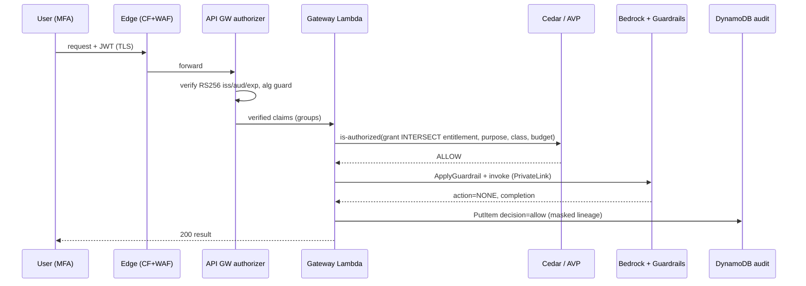
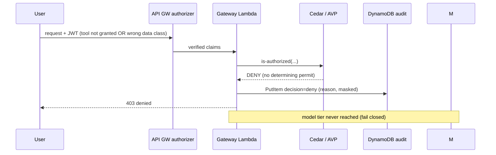
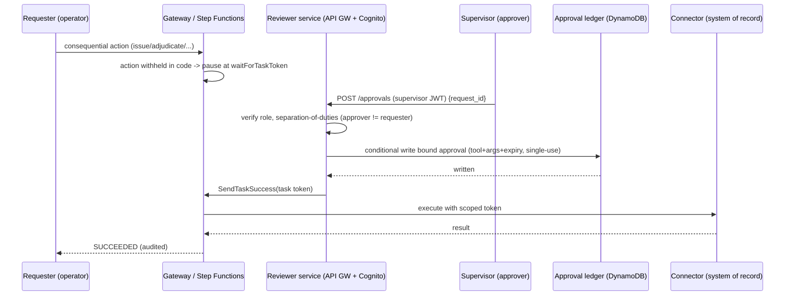
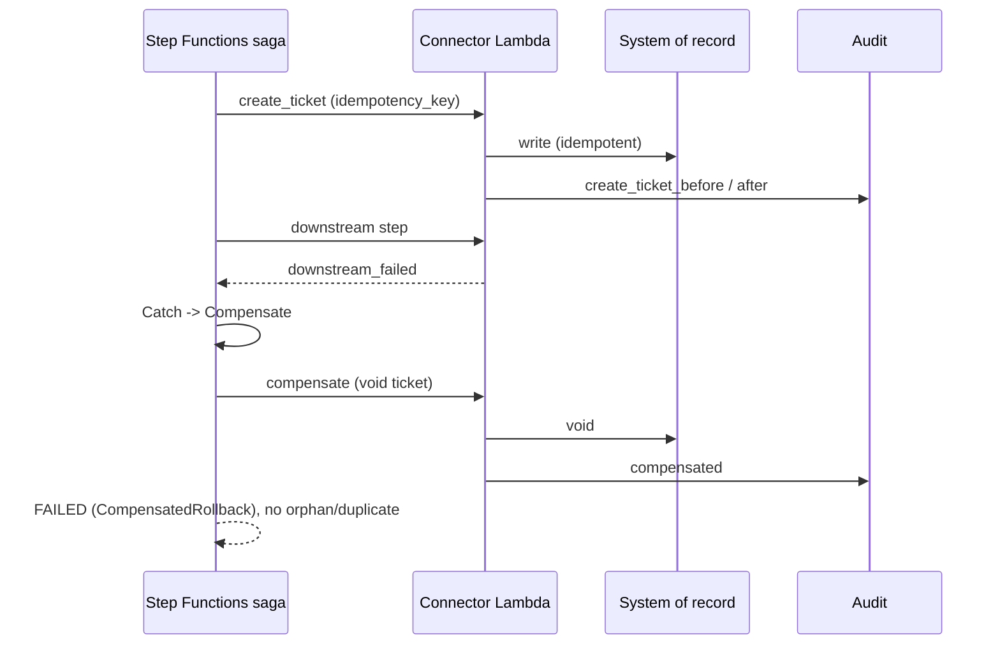

# Security Architecture — Aegis Governed Agent Platform

> **Status & maturity (read first).** This document describes the trust-boundary model and the
> request-time control flow of the Aegis control plane. Components named here are real and, where
> marked, deployed and live-validated (see [`../../DEPLOYED-AND-VALIDATED.md`](../../DEPLOYED-AND-VALIDATED.md)).
> Maturity language (**DA/IO/IT/CC/P**) follows [`../GAP-CLOSURE-BACKLOG.md`](../GAP-CLOSURE-BACKLOG.md).
> Read alongside [`../02-REFERENCE-ARCHITECTURE.md`](../02-REFERENCE-ARCHITECTURE.md) and
> [`THREAT-MODEL.md`](THREAT-MODEL.md).

## 1. Components in the security path

| Component | Role in the security path | Maturity |
|---|---|---|
| CloudFront + WAF + Shield | TLS termination, OWASP managed rules, rate limit, DDoS absorption | CC |
| Cognito + MFA | Federated identity, software-token MFA required, advanced security enforced | DA (Run 4) |
| API Gateway JWT authorizer | Verifies RS256 token (issuer/audience/expiry, alg-confusion guard) before any Lambda runs | DA (Run 7) |
| Cedar / Amazon Verified Permissions (AVP) | Deterministic authorization outside the agent loop (default-deny predicate) | DA (Run 3) |
| Gateway Lambda (control plane) | Re-validates identity, evaluates the predicate, mints scoped token, applies guardrail, writes audit, fails closed | DA (Run 1, Run 2) |
| Bedrock + Guardrails (over PrivateLink) | Private-connectivity inference to the regional Bedrock service; PII filters + contextual grounding + denied topics | DA (Run 1) |
| DynamoDB append-only audit + approval ledger | Tamper-evident record; single-use bound approvals | DA (Run 1, Run 5) |
| S3 Object Lock (WORM) | Immutable evidence retention | DA (Run 6) |
| Reviewer service (API GW + Cognito authorizer) | Human gate: verified-role, separation-of-duties, bound single-use approval | DA (Run 5, Run 7) |
| Governed connector (idempotency + saga) | Consequential action against a system of record, with compensation | DA (Run 9) |

## 2. Trust-boundary description

A request enters at **TB-1 (edge)** where WAF and Shield absorb hostile traffic and TLS is
terminated. It crosses **TB-2 (identity)** at the API Gateway JWT authorizer, which converts a
bearer token into a cryptographically verified principal and role claim; nothing downstream trusts
a client-asserted role. At **TB-3 (control plane)** the gateway Lambda re-validates identity as
defense in depth and evaluates the full authorization predicate against Cedar/AVP: authentication,
agent-grant intersect user-entitlement, purpose, data-class, consent, residency, budget, and
approval. Only an allowed call crosses **TB-4 (model tier)** to Bedrock over PrivateLink with
mandatory Guardrails, or **TB-6 (connector)** to a system of record via a scoped token. Every
decision is written across **TB-5 (data/evidence tier)** to the append-only audit and, for
evidence, to WORM storage. Consequential actions never cross TB-6 without a valid approval minted
by the reviewer service.

Every boundary **fails closed**: guardrail error/intervention, unverifiable identity, invalid or
unsigned manifest, unavailable policy engine, masking failure, unregistered tool, or audit-write
failure all resolve to *deny* rather than *allow* (GAP-CLOSURE P0 #2; Run 2 hardened the deployed
gateway to fail closed).

## 3. Sequence diagrams

### 3.1 Authorized tool call (allow)



### 3.2 Deny — least-privilege / data-class violation



### 3.3 Human-gated consequential action (approval)



### 3.4 Replay rejection

```mermaid
sequenceDiagram
    participant S as Approver (or attacker)
    participant R as Reviewer service
    participant L as Approval ledger
    S->>R: POST /approvals (replay consumed approval)
    R->>L: conditional write (expects unconsumed)
    L-->>R: ConditionalCheckFailed / already-consumed
    R-->>S: 404 (approval already consumed)
    Note over R,L: single-use enforced; Run 5 replay -> 404
```

### 3.5 Downstream failure -> saga compensation



## 4. Defense-in-depth summary

Authorization is enforced at three layers: the API Gateway authorizer (identity), Cedar/AVP
(policy, outside the agent loop), and the gateway Lambda (re-validation + budget + guardrail +
audit). Integrity is enforced at two layers: append-only IAM on the audit table and WORM on
evidence. Consequential actions are constrained in code (withheld from executable grants) and by
process (bound, single-use, separation-of-duties approval). This layering is what lets the platform
answer "can the AI act on its own?" with "no", and back it with live evidence.
